# Machine Learning Projects Repository

A collection of Machine Learning projects demonstrating various deep learning techniques including Artificial Neural Networks (ANN), Convolutional Neural Networks (CNN), and Natural Language Processing (NLP).

**Author:** Joyjit Roy  
**Email:** joyjit.roy@gmail.com

**Co-Author:** Samaresh Kumar Singh  
**Email:** ssam3003@gmail.com

---

## �️ Project Overview

```mermaid
flowchart TB
    subgraph repo["📁 Machine Learning Repository"]
        direction TB
        
        subgraph ann["🏦 Bank Churn Prediction"]
            A1[Customer Data] --> A2[Data Preprocessing]
            A2 --> A3[Feature Engineering]
            A3 --> A4[ANN Model]
            A4 --> A5[Churn Prediction]
        end
        
        subgraph cnn["🌱 Plant Seedling Classification"]
            B1[Plant Images] --> B2[Image Preprocessing]
            B2 --> B3[Data Augmentation]
            B3 --> B4[CNN Model]
            B4 --> B5[Species Classification]
        end
        
        subgraph nlp["📈 Stock Sentiment Analysis"]
            C1[Financial News] --> C2[Text Preprocessing]
            C2 --> C3[Word Embeddings]
            C3 --> C4{Embedding Type}
            C4 --> C5[Word2Vec]
            C4 --> C6[GloVe]
            C4 --> C7[SentenceTransformer]
            C5 & C6 & C7 --> C8[Gradient Boosting]
            C8 --> C9[Sentiment Prediction]
        end
    end
    
    style repo fill:#f5f5f5,stroke:#333,stroke-width:2px
    style ann fill:#e3f2fd,stroke:#1976d2,stroke-width:2px
    style cnn fill:#e8f5e9,stroke:#388e3c,stroke-width:2px
    style nlp fill:#fff3e0,stroke:#f57c00,stroke-width:2px
```



---

## �📂 Repository Structure

```plaintext
Machine_Learning/
├── README.md
├── Bank_Customer_Churn_Prediction_using_Artificial_Neural_Networks.ipynb
├── Plant_Seeding_Classification_using_CNN.ipynb
└── NLP_Stock_Sentiment_Analysis/
    ├── README.md
    ├── NLP_Stock_Sentiment_Analysis_Full_Code.ipynb
    └── stock_news.csv
```

---

## 🚀 Projects

### 1. Bank Customer Churn Prediction using Artificial Neural Networks

[](https://colab.research.google.com/github/joyjitroy/Machine_Learning/blob/main/Bank_Customer_Churn_Prediction_using_Artificial_Neural_Networks.ipynb)

**Objective:** Build a neural network-based classifier to predict whether a bank customer will leave within the next 6 months.

**Problem Context:** Banks providing services need to address the problem of "Customer Churn" — customers leaving and joining competing service providers. Understanding which aspects of service influence a customer's decision is critical for business improvement.

**Dataset Features:**
- Customer demographics (Age, Gender, Geography)
- Account information (Balance, NumOfProducts, Tenure)
- Credit information (CreditScore, HasCrCard)
- Activity status (IsActiveMember, EstimatedSalary)
- Target: Exited (0 = Stayed, 1 = Left)

**Techniques Used:**
- Data preprocessing and exploratory data analysis
- Feature engineering and encoding
- Neural network architecture design with TensorFlow/Keras
- Model evaluation using accuracy, precision, recall, and F1-score
- Handling imbalanced datasets

---

### 2. Plant Seedling Classification using CNN

[](https://colab.research.google.com/github/joyjitroy/Machine_Learning/blob/main/Plant_Seeding_Classification_using_CNN.ipynb)

**Objective:** Build a Convolutional Neural Network to classify plant seedlings into their respective categories.

**Problem Context:** Agriculture is in urgent need of modernization. The ability to automatically identify plant seedlings using AI and Deep Learning can significantly reduce manual labor, improve crop yields, and enable more sustainable agricultural practices.

**Dataset:**
- Images of unique plants belonging to **12 different species**
- Dataset provided by Aarhus University Signal Processing group in collaboration with the University of Southern Denmark

**Plant Species:**
- Black-grass, Charlock, Cleavers, Common Chickweed
- Common Wheat, Fat Hen, Loose Silky-bent, Maize
- Scentless Mayweed, Shepherds Purse, Small-flowered Cranesbill, Sugar beet

**Techniques Used:**
- Image preprocessing and augmentation
- CNN architecture design
- Transfer learning techniques
- Model evaluation and visualization

---

### 3. NLP Stock Sentiment Analysis

[](https://colab.research.google.com/github/joyjitroy/Machine_Learning/blob/main/NLP_Stock_Sentiment_Analysis/NLP_Stock_Sentiment_Analysis_Full_Code.ipynb)

**Objective:** Build an AI-driven sentiment analysis system to process and analyze financial news articles and gauge market sentiment.

**Problem Context:** Investment firms need sophisticated tools to analyze market sentiment from the vast volume of news and opinions. This project develops a reproducible NLP-based pipeline for classifying financial news sentiment and aggregating weekly sentiment trends.

**Embedding Approaches Evaluated:**
- **Word2Vec** (trained locally, 300-dimensional)
- **GloVe** (pretrained, 100-dimensional)
- **SentenceTransformer-based sentence embeddings** (384-dimensional)

**Key Features:**
- End-to-end NLP pipeline for financial sentiment
- Gradient Boosting classifier with hyperparameter tuning
- Temporal aggregation into weekly sentiment indicators
- LLM-generated weekly financial summaries using Mistral-7B-Instruct

**Model Performance (Tuned GloVe model):**
- Accuracy: 0.714
- Precision: 0.758
- Recall: 0.714
- F1 Score: 0.694

**Resources:**
- Zenodo DOI: https://doi.org/10.5281/zenodo.17510735
- Hugging Face: https://huggingface.co/joyjitroy/Stock_Market_News_Sentiment_Analysis

---

## 🛠️ Technologies & Libraries

- **Deep Learning:** TensorFlow, Keras
- **Machine Learning:** scikit-learn, imbalanced-learn
- **NLP:** NLTK, Gensim, SentenceTransformers
- **Data Processing:** Pandas, NumPy
- **Visualization:** Matplotlib, Seaborn
- **Computer Vision:** OpenCV

---

## ⚙️ How to Run

1. **Clone the repository:**
```bash
git clone https://github.com/joyjitroy/Machine_Learning.git
cd Machine_Learning
```

2. **Open notebooks in Google Colab** (recommended for GPU support):
   - Click the "Open in Colab" badge on any project above

3. **Or run locally:**
```bash
pip install tensorflow scikit-learn pandas numpy matplotlib seaborn
jupyter notebook
```

---

## 📬 Contact

**Email:** joyjit.roy@gmail.com  
**LinkedIn:** https://www.linkedin.com/in/royjoyjit

---

## 📄 License

This project is open source and available under the [MIT License](LICENSE).
